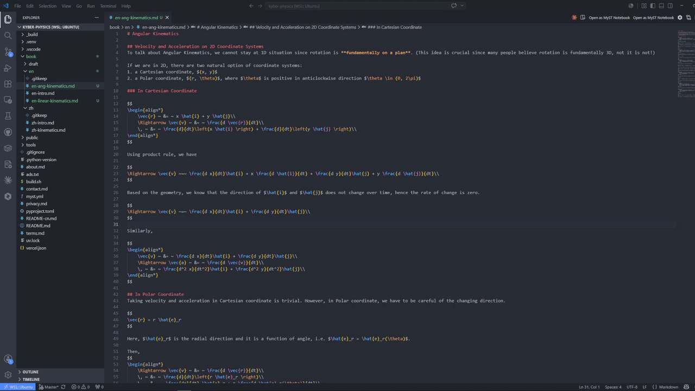
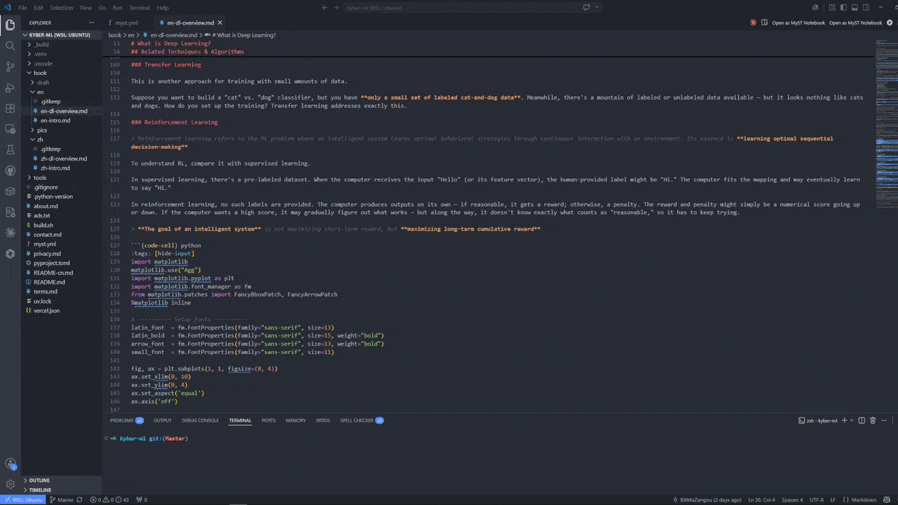
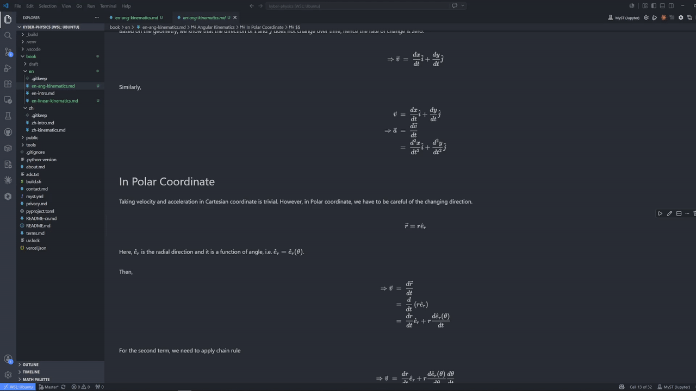
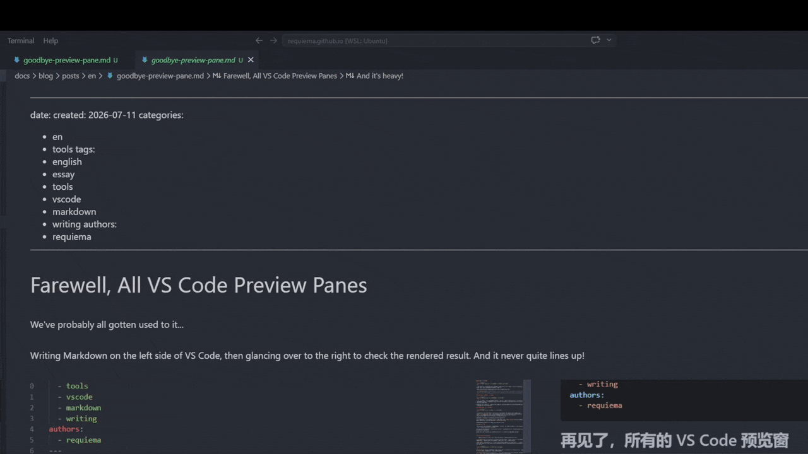

# MyST Notebook: Write Jupyter Book in VS Code Without a Preview Pane

**A VS Code extension that renders MyST Markdown inline — prose, math, code cells, all in one editor. No build step, no browser, no split view.**

---

If you write technical books with [Jupyter Book](https://jupyterbook.org/) and MyST Markdown, you know the workflow:

1. Type in a plain text editor.
2. Run `jupyter-book build`.
3. Open the HTML output in a browser.
4. Find the thing that looks wrong.
5. Go back to step 1.

Some people use the built-in Markdown preview — but that's MyST-unaware. Others write in Jupyter Lab — but that lives in a browser and doesn't feel like writing. Every option splits your attention between writing and verifying.

I've been writing MyST documents for a while now, and about three months ago I realized: **VS Code already has a notebook editor that renders cells in place. What if MyST `.md` files opened there natively?**

So I built it.

---

## What it looks like

<!-- GIF: Clip 1 — open → render -->

  

You open a MyST `.md` file as a notebook. Each paragraph is a cell. When you move focus away, the cell renders in place — headings, lists, equations, admonitions, figures. Math renders with KaTeX (bundled, no CDN). You never leave the editor.

There's a split-on-Enter behavior that creates new cells as you write. Finish a paragraph, press Enter — a new cell opens below with the cursor in it. It's the same flow as a normal editor, just with rendering.

---

## Code cells actually run

<!-- GIF: Clip 2 — code execution -->

  

`{code-cell}` blocks are executable. Press **Ctrl+Shift+E** to insert one, press **Shift+Enter** to run it. Output streams incrementally as the cell runs.

MyST Notebook discovers your Python environment via the Python extension — venv, conda, pyenv, poetry, whatever. It launches its own Jupyter server, so you don't need the 450 MB Jupyter extension installed. The kernel lifecycle (start, restart, interrupt) is managed from the Command Palette.

---

## Math that works

<!-- GIF: Clip 3 — math input -->

  

Type `$E = mc^2$` and it renders. Type `$$\int_0^\infty e^{-x}dx = 1$$` and it renders as display math. Inside a math block, typing `\` triggers autocomplete — `\alpha`, `\beta`, `\infty`, all the symbols you actually use.

There's also a **Math Palette** sidebar that collects your frequently-used symbols. Click to insert, or assign them to Ctrl+1–9 hotkeys.

---

## Knowledge graph, not file tree

<!-- GIF: Clip 4 — graph -->

  

`[[wikilinks]]` work natively — autocomplete, hover previews, backlinks, and a D3 force graph. The graph is MyST-aware: `{cite}` references from your bibliography become graph nodes too, so your references become part of the navigation structure.

This is adapted from [Foam](https://foambubble.github.io/foam/) — the graph engine runs locally with no external dependencies.

---

## Zotero citations, one command

One setup command (**MyST: Configure Zotero Citations**) wires up the [Citation Picker for Zotero](https://marketplace.visualstudio.com/items?itemName=mblode.zotero) to emit MyST `{cite}` syntax. After that, **Alt+Shift+Z** opens your Zotero library and inserts a citation at the cursor.

---

## Lossless round-trip

This was the hard constraint from day one: `serialize(deserialize(source)) === source`. The file on disk is always a valid MyST `.md`. Nothing is reordered, rewritten, or reformatted. If you open the file in a plain text editor, it's exactly the MyST you wrote.

---

## Installation

1. Install **MyST Notebook** from the [VS Code Marketplace](#) <!-- update after publish -->
2. Open a `.md` file in a MyST / Jupyter Book project (one with a `myst.yml`)
3. Right-click the tab → **Reopen Editor With… → MyST Notebook**

Requirements: VS Code 1.85+, Python extension (`ms-python.python`). A Python environment is only needed for code execution — editing and rendering work without one.

---

## What's next

This is v0.1.0 — the "first useful increment." Features planned for the next few releases:

- **Zotero picker bundled natively** (no dependency on the third-party extension)
- **`myst.yml` `bibliography:` scaffolding** — auto-discover your `.bib` file
- **Live preview for `{figure}` directives** — images rendering in-place from local paths
- **Open VSX publication** — install from Cursor, Windsurf, and other VS Code forks

---

## Why I built this

I write technical documents in MyST. Every existing tool made me choose between writing and seeing — plain editor plus build, or browser-based editor disconnected from my workflow. I wanted to *write the way the document reads*, in my editor, with one pane.

MyST Notebook is the tool I wanted. If you've felt the same friction, try it. It's free, open source (MIT), and it always will be.

---

🔗 **GitHub:** [RequieMa/myst-notebook](https://github.com/RequieMa/myst-notebook) <!-- update after push -->

---

*Originally published on [dev.to](#) — canonical URL at [requiema.github.io](#)*
