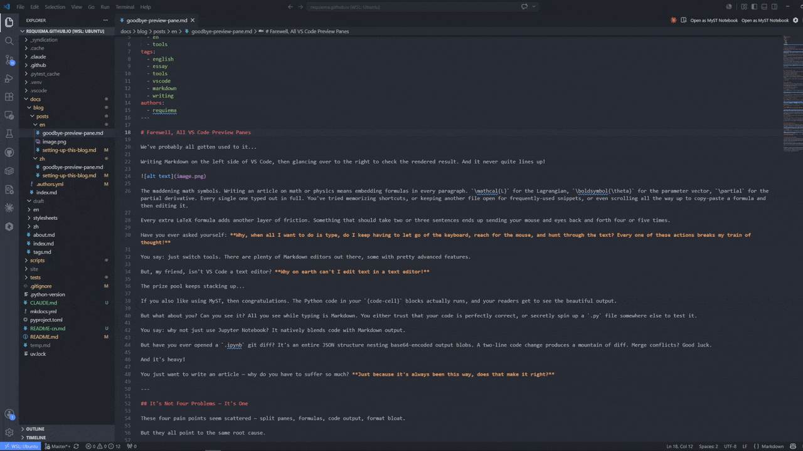

<sub>🌐 <b>English</b> <!-- · <a href="README-cn.md">中文</a> --></sub>

# MyST Notebook

> *"Write MyST Markdown e-books in VS Code — rendered inline, no preview pane, no build step."*

[](LICENSE)
[](https://code.visualstudio.com/)
<!-- Coming: VS Code Marketplace version badge -->

<br>

**Edit MyST Markdown (`.md`) in VS Code's notebook editor.** Prose renders in place as you type, math renders inline with KaTeX, and `{code-cell}` blocks run through Jupyter — all in one pane, no separate preview, no build step.

[Install](#quick-start) · [Features](#whats-here) · [Shortcuts](#keyboard-shortcuts) · [Structure](#repository-structure)

---

<!--
  Hero GIF: show opening a .md as MyST Notebook → typing prose → rendering → running a code cell.
  Record 20–30 seconds of the Extension Development Host.
-->
<p align="center">
  
</p>

---

## Quick Start

Install from the VS Code Marketplace, open a MyST `.md`, and start writing.

1. Install **MyST Notebook** from the [VS Code Marketplace](#) <!-- link after publish -->
2. Open a `.md` file in a MyST / Jupyter Book project (one with a `myst.yml`)
3. Click **Open as MyST Notebook** in the editor toolbar, or right-click the tab → **Reopen Editor With… → MyST Notebook**

To make MyST Notebook the default for `.md` files: **Command Palette → Configure default editor for '.md' → MyST Notebook**.

**Requirements:** VS Code 1.85+ · [Python extension](https://marketplace.visualstudio.com/items?itemName=ms-python.python) (for code execution) · A Python environment (optional — editing and rendering work without one)

---

## What's Here

| Capability | What it does | How to use |
|------------|-------------|------------|
| **Inline rendering** | Prose, math (`$…$`, `$$…$$`), admonitions, figures — all render in place when you move focus | Just type, then move to another cell |
| **Executable code cells** | `{code-cell}` blocks run through Jupyter, output streams live | `Ctrl+Shift+E` to insert, `Shift+Enter` to run |
| **Knowledge graph** | `[[wikilinks]]`, backlinks, and a D3 force graph — MyST-aware, including `{cite}` roles as nodes | `Ctrl+Shift+G` to open the graph |
| **Zotero citations** | Insert `{cite}` references from your Zotero library, one command to configure | Run **MyST: Configure Zotero Citations**, then `Alt+Shift+Z` |
| **Math palette** | Collect frequently-used LaTeX symbols, insert with hotkeys | Type `\` inside `$…$` for autocomplete, or `Ctrl+Shift+M` for the picker |
| **Auto-split** | Press Enter at end of a paragraph → new cell below, cursor ready | Just press Enter after finishing a paragraph |

---

## Demo Gallery

<!-- One entry per key feature. Record GIFs from the Extension Development Host (F5). -->

### Inline rendering + auto-split

<p align="center"></p>

Prose and math render when you leave a cell. Auto-split creates new cells as you write — no mouse, no toolbar, no modal dialogs.

### Code execution

<p align="center"></p>

`{code-cell}` blocks discover your Python environment and stream output live. No Jupyter extension required.

### Knowledge graph

<p align="center"></p>

`[[wikilinks]]` and `{cite}` references become graph edges. Navigate your book by structure, not by file tree.

---

## Keyboard Shortcuts

### Writing & cells

| Key | Action |
|-----|--------|
| **Enter** | Split cell at cursor (or newline inside a fence / empty cell) |
| **Alt+Enter** | Insert a literal newline without splitting |
| **Shift+Enter** | Run cell and advance |
| **Ctrl+Shift+E** | Insert executable `{code-cell}` below |
| **Ctrl+Shift+D** | Insert display-only code block below |
| **Ctrl+D** | Delete selected cell (when not in edit mode) |

### Math & citations

| Key | Action |
|-----|--------|
| **`\`** inside `$…$` | Autocomplete LaTeX symbols |
| **Ctrl+Shift+M** | Open math symbol picker (recently used first) |
| **Alt+Shift+Z** | Open Zotero citation picker |

### Kernel management (Command Palette)

| Command | Action |
|---------|--------|
| **MyST: Restart Kernel** | Restart kernel, clear all state |
| **MyST: Interrupt Kernel** | Send SIGINT to interrupt a running cell |

---

## Repository Structure

```
myst-notebook/
├── src/
│   ├── extension.ts          # activation entry point
│   ├── mystSerializer.ts     # lossless .md ↔ notebook round-trip
│   ├── kernelSession.ts      # Jupyter kernel lifecycle
│   ├── core/                 # pure functions: split, serialize, tags, templates
│   └── graph/                # knowledge graph (foam core + webview + VS Code features)
├── renderer/                 # notebook renderer (markdown-it + KaTeX)
├── media/                    # walkthrough images
├── test-fixtures/            # sample MyST workspace for smoke tests
├── .github/workflows/        # CI (build + test) and release (vsce publish)
├── esbuild.js                # bundle script
├── package.json              # extension manifest
└── README.md
```

---

## Limitations

- **Relative local image paths** in `figure`/`image` directives may not resolve in the renderer sandbox. Use absolute `https://` URLs or data URIs.
- **CRLF line endings** are out of scope for v1 (LF assumed).
- **Blank-line normalization** between blocks is canonicalized to one blank line on first save. Already-canonical files round-trip byte-for-byte.

---

## Why I Built This

I write technical documents in MyST, and every existing workflow forced the same compromise: write blind in a plain editor, then run a build to see if it looked right. Preview panes split my attention; Jupyter pulled me into a browser; Quarto and JupyterBook made me stop and compile. None of them let me *write* the way the document actually reads.

So I built the tool I wanted — the source file **is** the notebook, rendered in place, no build step, no second window. If you've felt the same friction, this is for you.

---

## Connect

| Platform | Link |
|----------|------|
| GitHub | [@RequieMa](https://github.com/RequieMa) |
| Blog | [requiema.github.io](https://requiema.github.io) |

---

## License

MIT © 2026 [zengma](https://github.com/RequieMa)
